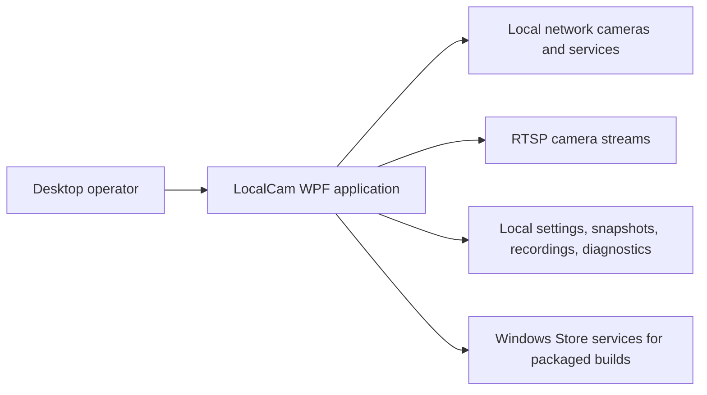
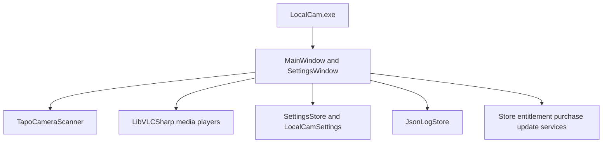

# LocalCam Architecture and Design Baseline

## System context

## Container view

## Responsibilities

- `App.xaml.cs`: application bootstrap, diagnostics initialization, and shutdown coordination.
- `MainWindow.xaml(.cs)`: dashboard, discovery lifecycle, tile state, playback, snapshots, recording, status, Store UI orchestration, and cleanup.
- `Networking/TapoCameraScanner.cs`: interface enumeration, network probing, detection scoring, method preference, and diagnostics data.
- `SettingsWindow.xaml(.cs)`: settings editing, validation, folder selection, dirty-state handling, and save/discard behavior.
- `Models/LocalCamSettings.cs`: persisted settings and operational state model.
- `Services/SettingsStore.cs`: JSON settings file load/save.
- `Services/JsonLogStore.cs`: structured JSONL diagnostics.
- `Services/*Store*`: packaged entitlement, purchase, and update integrations.

## Critical runtime flows

### Startup and discovery

`App` initializes diagnostics -> `MainWindow` loads settings -> window bounds and tiles are initialized -> LibVLC is initialized -> optional auto-detection scans -> detections populate tiles -> optional auto-stream starts playback.

### Stream start

User or auto-start requests playback -> configuration is validated -> invalid configuration opens Settings -> valid configuration builds escaped RTSP URL -> LibVLC media/player starts -> tile and status state update -> failures are logged and surfaced.

### Recording

Active tile requests recording -> output folder is validated -> existing recording is stopped if necessary -> `.ts` recorder starts -> timer tracks segment duration -> rollover starts the next segment -> recorder events remain authoritative for final state.

## Data stores and boundaries

- Settings: local JSON under `%LocalAppData%\\LocalCam`.
- Diagnostics: structured JSONL under the application’s local diagnostics location; exact runtime path should be kept aligned with `README.md` and `SPECIFICATION.md`.
- Media output: default `%UserProfile%\\Pictures\\LocalCam` and `%UserProfile%\\Videos\\LocalCam`, or directly in a selected non-default folder.
- Network: local discovery and RTSP connections; no server-side application backend is present.

## Architecture risks

- `MainWindow.xaml.cs` owns many responsibilities, increasing change coupling and making automated testing difficult.
- Discovery is heuristic and network-environment dependent.
- There are no current test source files despite a test project.
- Store and development paths coexist in the same UI orchestration surface.
- Credential handling is local and URL construction must remain carefully escaped and never be logged in clear text.
