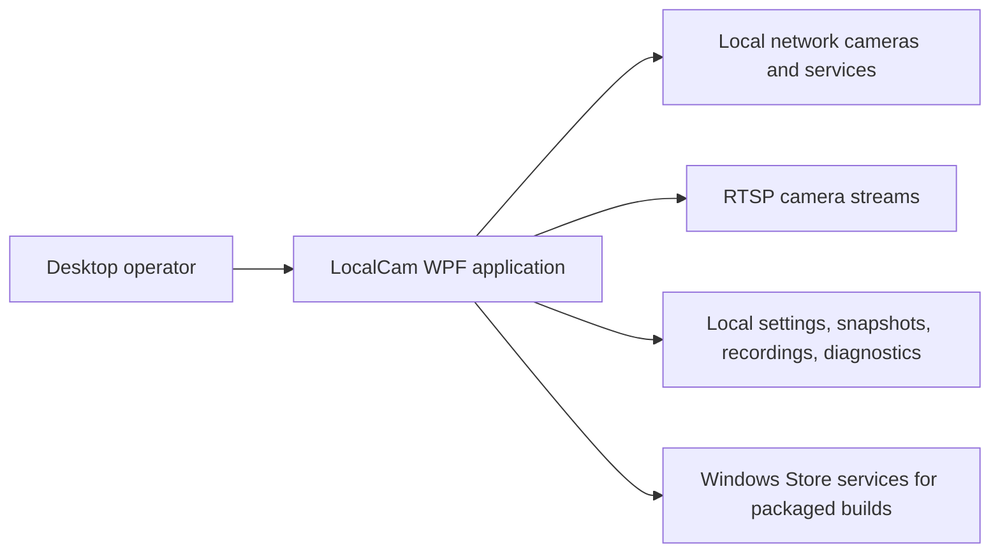
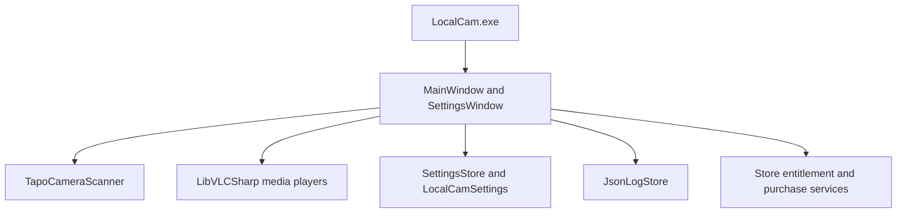

# LocalCam Architecture and Design Baseline

## System context

```mermaid
flowchart LR
  User[Desktop operator] --> App[LocalCam WPF application]
  App --> Network[Local network cameras and services]
  App --> RTSP[RTSP camera streams]
  App --> Files[Local settings, snapshots, recordings, diagnostics]
  App --> Store[Windows Store services for packaged builds]
```

## Container view

```mermaid
flowchart TD
  App[LocalCam.exe]
  UI[MainWindow and SettingsWindow]
  Scan[TapoCameraScanner]
  Media[LibVLCSharp media players]
  Persist[SettingsStore and LocalCamSettings]
  Logs[JsonLogStore]
  StoreSvc[Store entitlement and purchase services]
  App --> UI
  UI --> Scan
  UI --> Media
  UI --> Persist
  UI --> Logs
  UI --> StoreSvc
```

## Responsibilities

- `App.xaml.cs`: application bootstrap, diagnostics initialization, and shutdown coordination.
- `MainWindow.xaml(.cs)`: dashboard, discovery lifecycle, tile state, playback, snapshots, recording, status, Store UI orchestration, and cleanup.
- `MainWindow` uses standard WPF window chrome; native window management is delegated to Windows while window-bound persistence remains owned by the main-window lifecycle.
- Window framing: `MainWindow` and `SettingsWindow` use native WPF window frames. Their client content begins at a root `Grid`; decorative outer border wrappers are not used. Internal borders remain for panels, cards, separators, controls, and popup surfaces.
- Button styling: `App.xaml` owns `GlobalButtonStyle`, using the Settings regular-button configuration as the app-wide baseline. The implicit `Button` style is based on it, and every specialized button style (including code-created camera-card buttons) must derive from it. Specialized styles may override only presentation-specific properties required by their control surface.
- `Networking/TapoCameraScanner.cs`: IPv4 interface enumeration, preserved local protocol orchestration, a two-stage automatic additional unicast pass after local methods finish whether or not they found cameras (up to eight /24 ranges and 2,032 hosts), completion of remaining selected stage ranges after partial detections, bounded per-host probing/cache, detection scoring, method preference, and diagnostics data.
- `Networking/AdaptiveRtspVerificationProbe.cs`: bounded unauthenticated RTSP OPTIONS/DESCRIBE verification that prioritizes candidates with confirmed-open RTSP ports, then uses remaining budget on other responsive adaptive-search candidates. Outcomes record whether the target port was confirmed by the initial port probe. Credentials remain in the normal playback path.
- `Networking/Ipv4CidrRange.cs`, `Networking/CameraNetworkTopology.cs`, and `Networking/AdaptiveCameraNetworkPlanner.cs`: bounded IPv4 range enumeration, adapter/selected-route classification, and automatic candidate selection from recent cameras, DNS/DHCP addresses, and common home-network clues. These classify Windows-visible connection facts, not mesh/extender/backhaul product topology.
- `Networking/CameraDiscoveryParsers.cs`: bounded parsing and validation for ONVIF ProbeMatches, SSDP/UPnP, DNS-SD resource records, and RTSP responses with matching CSeq and authentication-challenge headers.
- `SettingsWindow.xaml(.cs)`: settings editing, validation, folder selection, dirty-state handling, save/discard behavior, and packaged Store plan/Upgrade presentation.
- `SettingsWindow.xaml`: currently declares the System/Light/Dark selector without a local ComboBox ControlTemplate. This does not satisfy the complete Fluent-backed template requirement recorded in `AGENTS.md`; it is an open discrepancy, not an approved change to that guardrail.
- `Models/LocalCamSettings.cs`: persisted shared settings and operational state model, including recent camera endpoints and their validated RTSP port; there is no persisted user-entered CIDR list.
- `Services/SettingsStore.cs`: synchronized JSON settings load/save, null normalization, atomic replacement, and backup recovery.
- `Services/RecentCameraConnectionCache.cs`: expiry, failure-count, invalidation, and connection-cache reconciliation policy.
- `Services/AppThemeService.cs`: maps the persisted theme preference to WPF `Application.ThemeMode` and synchronizes LocalCam brush aliases from the active Fluent brush resources. Brush synchronization replaces frozen-resource instances with cloned brushes rather than mutating them.
- `Services/JsonLogStore.cs`: structured JSONL diagnostics.
- `Services/StoreContextProvider.cs`, `PremiumEntitlementService.cs`, `PremiumPurchaseService.cs`, and `PremiumEntitlementRules.cs`: packaged entitlement and purchase integrations.
- Store and entitlement services remain owned by `MainWindow`; `SettingsWindow` receives the resolved Store UI state and invokes the existing purchase flow through a MainWindow-owned callback. The MainWindow footer is a flat footer row with a Fluent-backed top separator and hosts the existing status/activity controls; the resolved version text is presented at the right edge of the Settings footer. Microsoft Store delivers packaged MSIX updates without a LocalCam update service or update UI.
- Toolchain: `global.json` pins .NET SDK `10.0.400` with roll-forward disabled. Visual Studio 2026 MSBuild is the required build host for FAST-BUILD and related repository build operations.

## Critical runtime flows

### Startup and discovery

`App` acquires the single-instance mutex and starts the activation listener -> `MainWindow` loads settings before `InitializeComponent()` -> the persisted WPF theme is applied -> Fluent-backed LocalCam brush aliases are synchronized -> the first visual tree, window bounds, and tiles are initialized -> the dashboard shell is shown -> LibVLC initializes asynchronously with visible status -> valid recent connections request playback immediately -> discovery refresh runs even when every cached reconnect succeeds, retaining pending reconnect confirmations while the scan runs -> results are reconciled with cached identities -> only newly found identities receive one auto-play request, while existing cached streams stay attached -> the valid persisted `LastSuccessfulDetectionMethod`, when present, runs first -> otherwise Tapo UDP broadcast and ONVIF WS-Discovery run concurrently, or run immediately after a preferred method outside that pair -> subsequent local order is mDNS/DNS-SD, SSDP/UPnP, ARP, RTSP OPTIONS, then subnet fallback -> each result publishes cumulative detections to `MainWindow` immediately -> the successful local method is persisted for the next scan -> after local methods finish, whether or not they found cameras, a bounded additional unicast pass selects candidate private networks from recent cameras and network clues -> hosts with open RTSP ports receive a capped unauthenticated verification sequence using OPTIONS and, on port 554, DESCRIBE at the configured path -> valid RTSP responses and authentication challenges become service evidence -> adaptive detections merge with prior results and only newly found endpoints use the existing credentialed playback path -> results and bounded target outcomes are logged without credentials. If shared RTSP settings are incomplete when a camera is found, discovery is canceled and Settings opens after scan cleanup. If configured credentials are rejected by a camera during discovery-triggered playback, the error stays on that camera card and does not stop discovery. Secondary launches signal and activate the existing instance.

### Theme change flow

`SettingsWindow` saves a new preference -> `MainWindow` applies the corresponding `ThemeMode` -> `AppThemeService` clones the active Fluent brushes into the existing LocalCam aliases -> XAML-bound controls update through dynamic resources -> dynamically created camera-card controls are refreshed in place -> active streams remain running. The current ComboBox-template discrepancy is tracked in [Runtime Pipelines and Change Guardrails](08-RUNTIME-PIPELINES-AND-CHANGE-GUARDRAILS.md).

### Stream start

Detect and Play, Play all, per-card Play, or a stream-validation retry requests playback -> configuration is validated -> invalid configuration opens Settings -> valid configuration builds escaped RTSP URL -> a player bound to an immutable detection identity accepts a playback request -> LibVLC `Playing` confirms the transport/play state and refreshes the recent-camera cache -> periodic health monitoring samples output state and playback counters -> the first video output or decoded/displayed-frame evidence is recorded separately from `Playing` -> if evidence does not arrive by the existing stale deadline, a distinct per-card no-video error is shown and bounded recovery runs for that camera only -> consecutive stale samples may trigger bounded recovery for other stalled cases -> terminal playback events receive one bounded restart attempt -> failures are classified, logged, and surfaced on the affected card. `Playing` continues to mean that LibVLC accepted and began the stream; it is not treated as proof that visible video frames arrived. During discovery, each newly reported identity is rendered and receives one playback request without waiting for remaining methods/stages. Missing shared RTSP settings cancel the scan and open Settings after cleanup; a camera-specific credential rejection or other playback failure remains isolated to its card while discovery continues. User-requested playback keeps the existing Settings escalation for credential-related failures. Detection reconciliation collapses duplicate known MAC identities, keeps existing detections in their current tile order, and appends new identities. A changed camera identity disposes the superseded tile player so late LibVLC events cannot affect a different camera. Recovery discovery keeps existing camera cards visible and leaves matching active players attached; only missing or replaced streams are reset or started.

The health monitor is deliberately periodic rather than event-wake-driven. A confirmed `Playing` event starts or ensures the single monitor loop but does not interrupt its sampling delay. Each camera has independent health samples, separate playback and video-evidence timestamps, recovery cooldown, and recovery-attempt limits; exhausting recovery stops automatic retries for that camera and leaves healthy camera streams untouched. Video evidence is based on LibVLC video output or decoded/displayed picture counters; media time or bytes alone indicate stream activity but do not confirm a video frame.

### Power transition

`PBT_APMSUSPEND` -> invalidate pending automatic recovery -> invoke the normal Stop All path -> stop any active recording and every player -> retain detections, tiles, shared RTSP settings, and recent-camera cache -> log the completed preparation. A resume notification is logged only; it does not restart playback, recording, discovery, or reconnect work.

Settings writes are coordinated by the MainWindow-owned settings object. Store and entitlement services request settings mutations through the UI persistence path so asynchronous continuations do not mutate or serialize the shared settings object from arbitrary threads. SettingsStore serializes file access, writes a flushed temporary file, atomically replaces the primary file, and retains the previous valid file as `settings.json.bak` for recovery.

### Recording

Active tile requests recording -> output folder is validated -> existing recording is stopped if necessary -> `.ts` recorder starts -> timer tracks segment duration -> rollover starts the next segment -> recorder events remain authoritative for final state.

## Data stores and boundaries

- Settings: local JSON under `%LocalAppData%\\LocalCam`.
- Diagnostics: structured JSONL under the Windows application-data local folder, with a non-executable-directory fallback for unpackaged desktop runs. Packaged local data is owned by the package and is removed by Windows during package uninstall. Log files rotate daily and files older than seven days are pruned.
- Media output: default `%UserProfile%\\Pictures\\LocalCam` and `%UserProfile%\\Videos\\LocalCam`, or directly in a selected non-default folder.
- Network: local discovery and RTSP connections; no server-side application backend is present.

## Architecture risks

- `MainWindow.xaml.cs` owns many responsibilities, increasing change coupling and making automated testing difficult.
- Discovery is heuristic and network-environment dependent. Automatic additional scanning can reach a routed camera subnet only when the selected Windows route, NAT/firewall path, and camera services permit it. Windows guest adapter metadata may not expose the host's physical camera subnet or identify mesh/backhaul/extender topology reliably. The bounded fallback cannot cover arbitrary private networks.
- Adaptive candidate probes use bounded unicast and run after the local methods whether or not local cameras were found. They do not create a VMware NAT route or bypass host/guest firewalls; remote subnets remain dependent on the OS-selected route and camera service reachability.
- Automated coverage exists for stream-failure classification and health evaluation, while broader WPF/media integration coverage remains a risk.
- Store and development paths coexist in the same UI orchestration surface.
- Credential handling is local and URL construction must remain carefully escaped and never be logged in clear text.
- Shared RTSP credentials are serialized in the local settings JSON; diagnostics redaction is not encryption or a credential-vault boundary.
- Video playback startup and recovery are sensitive to LibVLC output initialization and host graphics-driver behavior; Direct3D/driver diagnostics must be correlated with per-camera playback state before changing video-output options.
- WPF Fluent resources may expose frozen brushes; direct mutation during a theme change can terminate the process with `InvalidOperationException`. This is guarded by clone-and-replace synchronization in `AppThemeService`.
