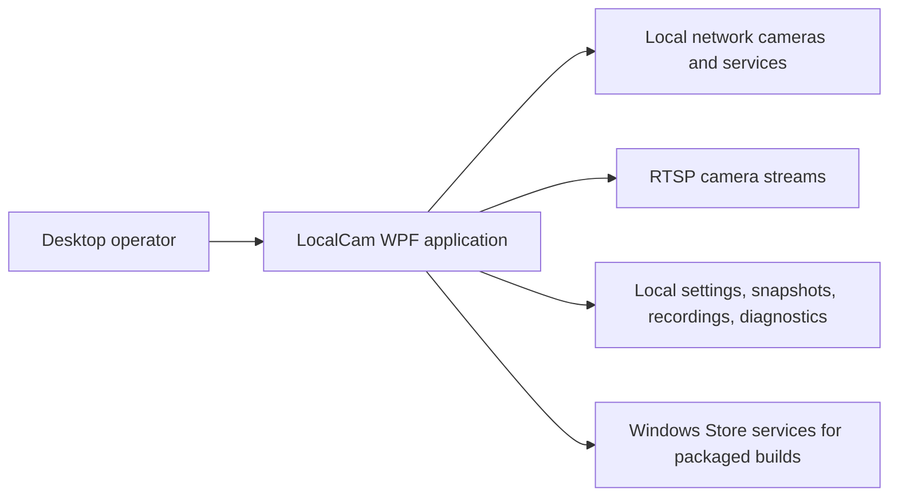
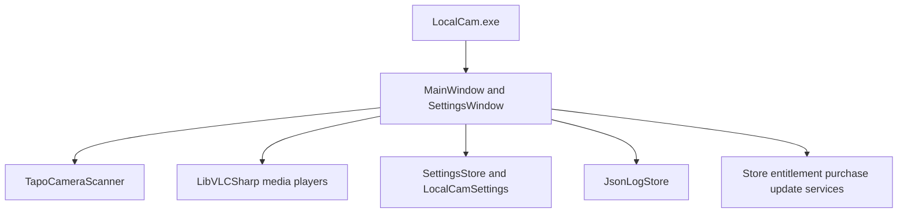

# LocalCam Architecture and Design Baseline

## System context

```mermaid
flowchart LR
  User[Desktop operator] --> App[LocalCam WPF application]
  App --> Network[Local network cameras and services]
  App --> RTSP[RTSP camera streams]
  App --> Files[Local settings, snapshots, recordings, diagnostics]
  App --> Store[Windows Store services for packaged builds]
```

## Container view

```mermaid
flowchart TD
  App[LocalCam.exe]
  UI[MainWindow and SettingsWindow]
  Scan[TapoCameraScanner]
  Media[LibVLCSharp media players]
  Persist[SettingsStore and LocalCamSettings]
  Logs[JsonLogStore]
  StoreSvc[Store entitlement purchase update services]
  App --> UI
  UI --> Scan
  UI --> Media
  UI --> Persist
  UI --> Logs
  UI --> StoreSvc
```

## Responsibilities

- `App.xaml.cs`: application bootstrap, diagnostics initialization, and shutdown coordination.
- `MainWindow.xaml(.cs)`: dashboard, discovery lifecycle, tile state, playback, snapshots, recording, status, Store UI orchestration, and cleanup.
- `MainWindow` uses standard WPF window chrome; native window management is delegated to Windows while window-bound persistence remains owned by the main-window lifecycle.
- Window framing: `MainWindow`, `SettingsWindow`, and `StoreUpdateProgressWindow` use native WPF window frames. Their client content begins at a root `Grid`; decorative outer border wrappers are not used. Internal borders remain for panels, cards, separators, controls, and popup surfaces.
- Button styling: `App.xaml` owns `GlobalButtonStyle`, using the Settings regular-button configuration as the app-wide baseline. The implicit `Button` style is based on it, and every specialized button style (including code-created camera-card buttons) must derive from it. Specialized styles may override only presentation-specific properties required by their control surface.
- `Networking/TapoCameraScanner.cs`: interface enumeration, network probing, detection scoring, method preference, and diagnostics data.
- `SettingsWindow.xaml(.cs)`: settings editing, validation, folder selection, dirty-state handling, and save/discard behavior.
- `SettingsWindow` uses the default WPF `ComboBox` behavior for the theme preference; no LocalCam-specific control or item template overrides its closed control, focus visual, arrow, popup, or highlighted items.
- `Models/LocalCamSettings.cs`: persisted settings and operational state model.
- `Services/SettingsStore.cs`: JSON settings file load/save.
- `Services/RecentCameraConnectionCache.cs`: expiry, failure-count, invalidation, and connection-cache reconciliation policy.
- `Services/AppThemeService.cs`: maps the persisted theme preference to WPF `Application.ThemeMode` and synchronizes LocalCam brush aliases from the active Fluent brush resources. Brush synchronization replaces frozen-resource instances with cloned brushes rather than mutating them.
- `Services/JsonLogStore.cs`: structured JSONL diagnostics.
- `Services/*Store*`: packaged entitlement, purchase, and update integrations.
- Toolchain: `global.json` pins .NET SDK `10.0.400` with roll-forward disabled. Visual Studio 2026 MSBuild is the required build host for FAST-BUILD and related repository build operations.

## Critical runtime flows

### Startup and discovery

`App` initializes diagnostics -> `MainWindow` loads settings before `InitializeComponent()` -> the persisted WPF theme is applied -> Fluent-backed LocalCam brush aliases are synchronized -> the first visual tree, window bounds, and tiles are initialized -> LibVLC is initialized -> valid recent connections reconnect first -> failed or absent cache entries fall back to local discovery -> confirmed playback refreshes the seven-day cache.

### Theme change flow

`SettingsWindow` saves a new preference -> `MainWindow` applies the corresponding `ThemeMode` -> `AppThemeService` clones the active Fluent brushes into the existing LocalCam aliases -> XAML-bound controls update through dynamic resources -> dynamically created camera-card controls are refreshed in place -> active streams remain running.

### Stream start

User or auto-start requests playback -> configuration is validated -> invalid configuration opens Settings -> valid configuration builds escaped RTSP URL -> a player bound to an immutable detection identity starts -> LibVLC `Playing` confirms the live state, refreshes the recent-camera cache, and enables health monitoring -> terminal playback events receive one bounded restart attempt -> failures are logged and surfaced. Detection reconciliation disposes a superseded tile player before assigning a new camera identity, so late LibVLC events cannot affect a reordered tile.

### Recording

Active tile requests recording -> output folder is validated -> existing recording is stopped if necessary -> `.ts` recorder starts -> timer tracks segment duration -> rollover starts the next segment -> recorder events remain authoritative for final state.

## Data stores and boundaries

- Settings: local JSON under `%LocalAppData%\\LocalCam`.
- Diagnostics: structured JSONL under the application’s local diagnostics location; exact runtime path should be kept aligned with `README.md` and `SPECIFICATION.md`.
- Media output: default `%UserProfile%\\Pictures\\LocalCam` and `%UserProfile%\\Videos\\LocalCam`, or directly in a selected non-default folder.
- Network: local discovery and RTSP connections; no server-side application backend is present.

## Architecture risks

- `MainWindow.xaml.cs` owns many responsibilities, increasing change coupling and making automated testing difficult.
- Discovery is heuristic and network-environment dependent.
- There are no current test source files despite a test project.
- Store and development paths coexist in the same UI orchestration surface.
- Credential handling is local and URL construction must remain carefully escaped and never be logged in clear text.
- WPF Fluent resources may expose frozen brushes; direct mutation during a theme change can terminate the process with `InvalidOperationException`. This is guarded by clone-and-replace synchronization in `AppThemeService`.
