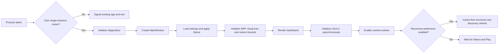
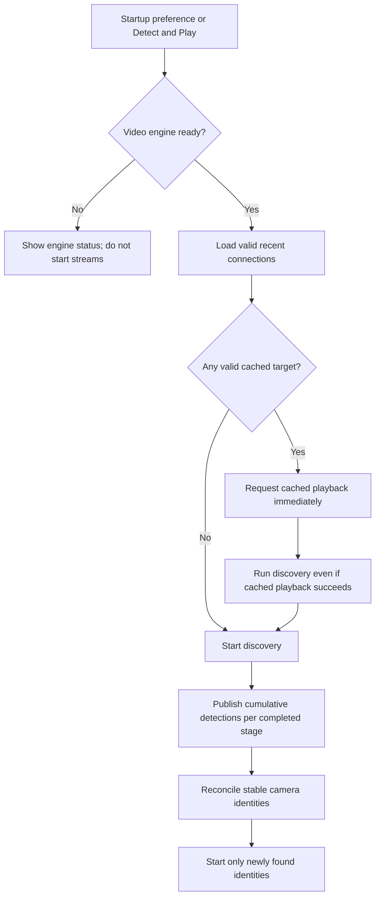
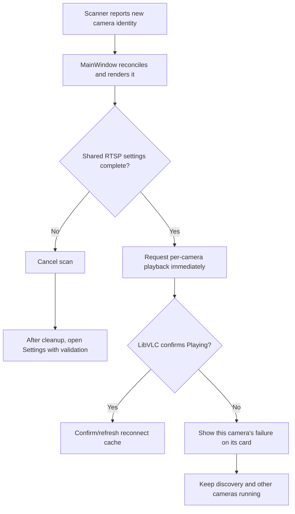

# Runtime Pipelines and Change Guardrails

Status: Current implementation map, checked against the repository on 2026-09-27

## Purpose and authority

This document records the implemented application routes and the behavior boundaries that protect them from accidental bypass, reordering, or drift. It is a code-grounded map, not a claim that every route has live integration coverage.

Authority order for changes:

1. The user's explicit scope and current behavior requirements.
2. The applicable accepted decisions in [05 Decisions and Constraints](05-DECISIONS-AND-CONSTRAINTS.md) and functional requirements in [02 SRS](02-SOFTWARE-REQUIREMENTS-SPECIFICATION.md).
3. The relevant implementation in the source files listed below.
4. This pipeline map, which must be corrected in the same change when implementation or an accepted requirement changes.

Do not resolve a conflict by silently changing runtime behavior or weakening an existing guardrail. Record the conflict, state what is verified in code, and update the relevant decision and verification evidence as part of the authorized change.

## Codebase map

| Area | Owner files | Responsibility and boundary |
|---|---|---|
| Process lifecycle | `App.xaml`, `App.xaml.cs` | WPF startup, named single-instance mutex, activation signal, creation of the primary `MainWindow`, shutdown of activation handles. A secondary process activates the primary and exits. |
| Main window and feature orchestration | `MainWindow.xaml`, `MainWindow.xaml.cs` | Dashboard state and tiles; startup and explicit discovery; incremental results; stream start/stop; health monitoring and recovery; snapshots and recordings; power events; settings handoff; packaged Store UI. This is the current orchestration hub and therefore a high-coupling area. |
| Settings UI | `SettingsWindow.xaml`, `SettingsWindow.xaml.cs`, `UnsavedChangesDialog.xaml(.cs)` | Edits shared RTSP settings, theme, reconnect preference, output folders; validation; dirty-state save/discard/cancel; folder selection; setup-guide link. It returns edits to MainWindow rather than owning active streams. |
| Camera discovery | `Networking/TapoCameraScanner.cs` | Enumerates connected IPv4 prefixes, executes the local protocol sequence, caches per-host probe outcomes, merges evidence, emits cumulative detections, and invokes the final adaptive search. Internal names and heuristics remain Tapo-first. |
| Discovery helpers | `Networking/AdaptiveCameraNetworkPlanner.cs`, `AdaptiveRtspVerificationProbe.cs`, `CameraDiscoveryParsers.cs`, `CameraNetworkTopology.cs`, `Ipv4CidrRange.cs` | Bounded candidate selection and CIDR enumeration; Windows-observable route/interface classification; bounded unauthenticated RTSP verification; protocol-response parsing. These helpers do not configure routes, access points, cameras, or firewalls. |
| Detection identity | `Services/CameraDetectionReconciler.cs`, `MainWindow.xaml.cs` | Uses MAC when unique in the current result and IP when the MAC is absent or shared across different IP endpoints; preserves order and tile/player bindings across representation-only changes. MainWindow owns playback and auto-start behavior. |
| Reconnect cache | `Models/LocalCamSettings.cs`, `Services/RecentCameraConnectionCache.cs` | Stores shared-credential camera address hints only after confirmed playback; validates expiry and reconnect failure policy. MAC is used for matching when unique; ambiguous MAC entries are matched by IP. It is not a permanent camera profile store. |
| Settings persistence | `Models/LocalCamSettings.cs`, `Services/SettingsStore.cs` | Shared settings model, normalization, synchronized JSON load/save, flushed temporary file, atomic replacement, and `.bak` recovery. |
| Theme | `Services/AppThemeService.cs`, `App.xaml`, `MainWindow.xaml(.cs)`, `SettingsWindow.xaml(.cs)` | Persists System/Light/Dark choice, applies it before MainWindow creates its visual tree, maps Fluent brushes to replaceable aliases, and refreshes dynamic camera-card surfaces. |
| Diagnostics | `Services/JsonLogStore.cs` | One sanitized JSONL route, UTC-day filenames, best-effort retention, package-local storage with unpackaged fallback. Logging failure must not block app behavior. |
| Streaming health | `Services/StreamHealthEvaluator.cs`, `MainWindow.xaml.cs` | Distinguishes transport playback from video-frame evidence; evaluates each active camera and bounds per-camera restart/recovery. |
| Store integration | `Services/*Premium*`, `Services/*Store*`, `BasicFeatureGateDialog.xaml(.cs)`, `MainWindow.xaml.cs`, `SettingsWindow.xaml(.cs)` | Packaged Store entitlement and purchase route; Basic/Premium behavior is governed by `docs/BASIC_PREMIUM_GATING_POLICY.md`. Unpackaged development runs hide Store gating UI. |
| Packaging | `LocalCam.Package/LocalCam.Package.wapproj`, `Package.appxmanifest`, `docs/STORE-SUBMISSION-GUIDE.md` | x64-only Store MSIX identity, capabilities, package build and submission workflow. Microsoft Store owns delivery; there is no in-app updater. |
| Verification | `LocalCam.Tests/` | xUnit unit/persistence coverage for discovery parsers/planners/probes, settings, cache/reconciliation, health/failure classification, JSON logs, and entitlement rules. It does not provide full WPF/LibVLC or real mesh/VMware-network integration coverage. |

There is no application server or database. Runtime settings, diagnostics, snapshots, and recordings use local Windows/user or package-owned storage; video flows directly from detected camera endpoints through LibVLC into WPF camera tiles.

## Protected end-to-end pipelines

### 1. Launch, activation, and first render

Guardrails:

- Keep the single-instance decision in `App.xaml.cs`; a secondary launch must not create a second dashboard or media engine.
- Settings and the saved theme are loaded/applied before `MainWindow.InitializeComponent()` builds the first visual tree.
- Initialize LibVLC after the dashboard can render. Keep actions gated until the engine is ready and retain its retryable failure state.
- Do not move theme application after first render or block dashboard rendering on video-engine setup.

### 2. Cache-first reconnect and discovery refresh

Guardrails:

- Recent connections are an uncapped, seven-day reconnect cache measured from confirmed LibVLC `Playing`, never a permanent inventory or user-managed profile list.
- Do not wait for discovery before requesting playback for cached cameras; do not skip discovery just because cache playback succeeded.
- Preserve reconnect attempt identity and timeout behavior. Evict only after two consecutive reconnect failures; intentional stop, app shutdown, cancellation, missing settings, or ordinary stream loss is not an eviction failure.
- A changed shared username, password, or normalized stream path invalidates the cache. Do not store per-camera credentials or complete RTSP URLs.
- Reconcile by MAC when unique in the current result and IP when the MAC is absent or shared across endpoints at distinct IPs. Preserve existing tiles and active players when only the identity representation changes for the same endpoint; only new resolved identities get an auto-play request.
- When a MAC is ambiguous in current detections or multiple cache entries, match reconnect-cache updates and failures by IP. Retain MAC-first matching for unique MACs so ordinary address changes continue to update the same camera entry.

### 3. Discovery sequence and network boundaries

Local method order is built in `Networking/TapoCameraScanner.cs`:

1. Run a valid persisted `LastSuccessfulDetectionMethod` first. It is resolved at the start of each scan and may have changed during the current app session.
2. With no preferred method, collect Tapo UDP and ONVIF WS-Discovery hints concurrently, then process evidence Tapo-first. If the preferred method is outside that pair, complete it first and then collect the pair concurrently. If the preferred method is one of the pair, run it first by itself and then the other member.
3. Continue local methods in this order: mDNS/DNS-SD, SSDP/UPnP, ARP-seeded target probe, RTSP OPTIONS probe, subnet fallback (subject to moving the persisted preferred method to the front).
4. After the local sequence, run the existing `AdaptiveRtspVerificationProbe` whether local methods found zero, some, or many cameras. It is a final existing method; do not add a parallel replacement path.

When local methods find a camera, the scanner reports cumulative detections to MainWindow immediately. MainWindow reconciles them and requests playback for new identities while the scan and later adaptive stages continue. The adaptive stage merges its results with those local detections. It does not overwrite an already selected successful local method when MainWindow saves `LastSuccessfulDetectionMethod`; the adaptive method is not persisted as the preferred local method.

Network boundaries and bounds:

- Connected IPv4 prefixes and active interface facts come from Windows networking APIs. Large connected prefixes are sampled by the scanner; they are not an exhaustive whole-private-address-space sweep.
- Adaptive candidates are inferred from recent confirmed camera addresses, interface DNS/DHCP clues, and a bounded list of common home-network seeds. The automatic planner excludes already connected prefixes and relies on Windows route selection; it does not read authoritative mesh topology.
- The adaptive planner caps candidates at 16, expansion at eight `/24` ranges across two stages, additional inventory at 2,032 hosts, and unauthenticated RTSP verification at 64 endpoints. Existing cancellation, request limits, receive limits, response parsing, and per-scan probe caching remain in force.
- Tapo UDP broadcast and ONVIF, SSDP, and mDNS multicast are local-link signals. A mesh, extender, AP, bridge, VLAN, NAT, route, or firewall can pass, filter, or isolate those signals. Do not describe a CIDR guess or multicast response as proof of a physical topology.
- Discovery never sends saved RTSP credentials. RTSP port 554 remains default; 8554 is carried to playback/reconnect only after a valid RTSP OPTIONS reply confirms that service.
- A successful local method updates `LastSuccessfulDetectionMethod` during the application session and persists it for the next scan. Do not pin a method at process startup or let the adaptive verifier replace the last successful local method.

### 4. Detection-to-playback and credential escalation

Guardrails:

- Do not conflate network reachability, a detected endpoint, LibVLC accepting `Play`, confirmed `Playing`, and visible video-frame evidence; they are different states.
- Missing or incomplete shared RTSP settings discovered during Detect and Play cancel discovery and open Settings after scanner cleanup. Preserve the exact required inline message and credential highlighting in `AGENTS.md`.
- If credentials are present but a camera rejects them or fails for another camera-specific reason, retain the error on that card and continue discovery for other cameras.
- Preserve stream URL escaping, path normalization/default `stream1`, shared credentials, validated port behavior, LibVLC options, state gating, and resource disposal. Do not add discovery authentication or custom URL/port controls without an explicit scope change.
- Playback confirmation updates the recent cache; a request accepted by LibVLC alone does not.

### 5. Active playback, health, and shutdown

- Each active identity owns its media player and video surface. Tile reorder/reconciliation must not let late callbacks or timeout work mutate another camera's state.
- The health loop is shared, but measurements, failure classification, recovery limits, cooldown, and terminal recovery are per camera. Video output or decoded/displayed-picture counters prove frame evidence; media time or bytes alone do not.
- Keep startup grace, stale thresholds, attempt limits, cooldowns, and the distinction between a no-frame failure and a transport failure in `StreamHealthEvaluator` and its MainWindow lifecycle.
- Stopping a stream stops its recording first. Stop All, window close, and system suspend use the normal cleanup path. System resume logs the event but does not silently restart streams, recording, discovery, or reconnect.
- Cleanup must cancel pending scan/reconnect/monitor/output-validation work and stop/dispose LibVLC players before the window exits.

### 6. Snapshot and recording output

- Snapshot requires a currently playing tile, uses a unique `.png` filename, and writes to `%UserProfile%\\Pictures\\LocalCam` when Pictures is selected/default; another selected folder is used directly.
- Recording requires active playback and valid shared RTSP configuration. Exactly one manual recording session exists across all tiles; switching cards stops the previous session first.
- Record to `.ts`, without remux/transcode, and roll over at 60 minutes only while the stream remains active. Recorder stop/end/error is authoritative; clear state and stop timers/output validation on every terminal path.
- Basic packaged recording usage is limited to 30 minutes per local day; Basic is limited to two active streams. Premium removes those limits. Preserve entitlement and development-mode gates as documented in `docs/BASIC_PREMIUM_GATING_POLICY.md`.
- Default output folders are created on demand. An inaccessible folder must produce user-visible failure and structured diagnostics; never silently redirect output to a different folder.

### 7. Settings, theme, and local persistence

- `SettingsWindow` edits a clone and returns it only after a valid save. Empty credentials can be saved; stream-start validation is separate. Do not mutate the MainWindow's shared settings state from the dialog before save succeeds.
- `SettingsStore` normalizes legacy data, preserves backup recovery, synchronizes file access, and writes atomically. Preserve unknown settings compatibility and keep cache invalidation tied to shared RTSP configuration changes.
- Effective defaults: stream path `stream1`; snapshot folder `%UserProfile%\\Pictures\\LocalCam`; recording folder `%UserProfile%\\Videos\\LocalCam`. Selected non-default folders are used directly.
- Theme preference is System/Light/Dark. Apply it before the first visual tree; use Windows Fluent brush resources; replace brush aliases with clones instead of mutating potentially frozen brushes. Runtime changes refresh dynamic cards without stopping streams.
- Store shared RTSP credentials only in the existing local settings path and use them only for the selected camera playback path. Keep credentials out of discovery requests, logs, copied camera information, and per-camera cache entries.

### 8. Diagnostics and packaging

- All builds use `JsonLogStore`; do not write diagnostics beside the executable. Packaged builds use package-local application data. Unpackaged runs fall back to `%LocalAppData%\\LocalCam\\LocalState\\logs`.
- Keep UTC-day `localcam-yyyyMMdd.jsonl` rotation, seven-day retention, nested-value/exception sanitization, and best-effort behavior. A logging error must not take down a scan, playback, or shutdown route.
- Log stable event names and useful non-secret context. Do not log credentials, authorization headers, complete RTSP URLs, or copied user data. Avoid high-volume per-host success logging.
- Use Visual Studio 2026 MSBuild and the exact SDK pin `10.0.400`. Routine Debug builds use the FAST-BUILD command from `AGENTS.md`; full package/solution builds are reserved for the stated packaging workflow or an explicit request.
- Keep runtime identifiers and Store packaging x64-only. Do not modify the package identity, publisher, or manifest version without following `docs/STORE-SUBMISSION-GUIDE.md` and its release-evidence gates.
- Microsoft Store owns MSIX update delivery. Do not add an in-app updater, package queue, or self-installation route.

## Change gates

For any proposed change that can affect one of these paths:

1. Identify the exact initiating action, owning method/service, state transitions, persistence writes, log events, and cleanup route before editing.
2. Name what must stay byte-for-byte or behaviorally stable, what new behavior is explicitly authorized, and the out-of-scope routes. Do not bundle unrelated cleanup.
3. If a change crosses discovery, UI, playback, settings, cache, or Store ownership, add/update an accepted decision before implementation and preserve a single source of truth for the rule.
4. Update the relevant FR/NFR, architecture flow, this guardrail map, and verification checklist together. Keep future roadmap ideas marked as proposals until explicitly approved.
5. Verify using the repository's pinned toolchain. Use focused tests only when authorized by the task/instructions; run the required manual checks for WPF, LibVLC, network topology, package identity, and power paths because unit tests cannot prove those routes.
6. Report verification gaps honestly. A build proves compilation, not that bridged, NAT, mesh, extender, routed, packaged, or real-camera behavior works.

## Verified gaps and limitations

- Discovery is IPv4 and heuristic. The adaptive search can only probe candidate ranges that its bounded inputs and Windows route clues identify; it cannot guarantee unknown subnets or overcome missing routes, NAT/firewall restrictions, VLAN isolation, or camera-side access controls.
- The app cannot authoritatively label mesh/extender/backhaul topology from the current adapter summary. These are physical/topological facts not exposed by the current scanner's classification.
- `MainWindow.xaml.cs` currently concentrates substantial orchestration, so moving a pipeline to another owner risks duplicate state and route drift. Refactor only under explicit scope and an updated decision/verification plan.
- `LocalCam.Tests` has unit and persistence coverage, but live WPF/LibVLC, full stream playback, all camera vendors, power transitions, and controlled VMware/mesh/extender network coverage remain separate verification work.
- Theme selector discrepancy: `AGENTS.md` requires a complete Fluent-backed custom ComboBox template for the closed control and dropdown, but `SettingsWindow.xaml` currently declares the System/Light/Dark ComboBox without a local ControlTemplate. This documentation task records the mismatch; it does not modify the control or waive the existing guardrail. Resolve it only in an explicitly scoped UI change with the required visual checks.
- Local RTSP credentials are serialized as fields in `settings.json`; the current code does not implement a separate credential vault. Any protection or storage-format migration requires explicit security scope and compatibility/rollback design.

## Related authoritative references

- [SRS](02-SOFTWARE-REQUIREMENTS-SPECIFICATION.md): acceptance behavior and quality bounds.
- [Architecture baseline](03-ARCHITECTURE-AND-DESIGN-BASELINE.md): system relationships and data flows.
- [Traceability and verification plan](04-TRACEABILITY-AND-VERIFICATION-PLAN.md): evidence and manual checks.
- [Decisions and constraints](05-DECISIONS-AND-CONSTRAINTS.md): accepted choices and history.
- [Basic/Premium policy](../BASIC_PREMIUM_GATING_POLICY.md): packaged access rules and restoration behavior.
- [Store submission guide](../STORE-SUBMISSION-GUIDE.md): package identity, version, build, and submission workflow.
